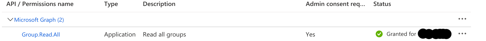

# krakend-azure-plugin

This krakend plugin extracts claims from a JWT token issued by Azure AD and turns them into specific 
request headers.

## 1. Example

For example a JWT cookie with the following claims:

    .....
    "family_name": "Paroulek",
    "given_name": "Pavel",
    "groups": [
    "28330f43-6b7c-4493-a3a4-7d69e255ac79",
    "7155f23e-e240-421b-8aa0-08902da12475",
    "b90br4ab-4dd1-435a-8b1d-3cef546f3c33"
    ],
    "ipaddr": "77.129.25.11", 
    "tid": "1b422a8e-f6fe-46ba-bd4b-1e8996f88282",
    "oid": "10ee82dd-020a-38ff-8e43-6a29abe032fe",
    .....
    
is transformed into the following request headers:

    From: 10ee82dd-020a-38ff-8e43-6a29abe032fe
    X-Auth-User-Groups: testgroup1, testgroup2, testgroup3
    X-Tenant-Id: 8379e38f_b9ed_4168_8a1b_69be764c9750
    
The transformations that take place are:

1. group IDs are translated to their Azure AD names
2. the *From* header field is computed trying first the *email* claim from JWT, if not 
present then the *verified_primary_email* claim and if also not present 
then the *oid* claim (which is mandatory in Azure AD i.e. always present)
3. dashes in *tid* claim (tenant-id) are replaced by underscores

## 2. Building the plugin

The plugin is built using the command:

    go build -trimpath -buildmode=plugin -o azure_plugin.so

## 3. Configuration of plugin

This section describes the configuration of the plugin. In order to configure the plugin 
the following environment variables should be set:

    AZURE_KRAKEND_PLUGIN_CLIENT_ID //mandatory
    AZURE_KRAKEND_PLUGIN_CLIENT_SECRET //mandatory
    AZURE_KRAKEND_PLUGIN_JWT_VALUE_PREFIX //optional, default value is ""
    AZURE_KRAKEND_PLUGIN_JWT_HEADER_NAME //optional, default is 'Authorization'
    AZURE_KRAKEND_PLUGIN_GROUP_UPDATE_IN_MINUTES //optional, default is 120 minutes

### 3.1. Plugin client configuration
  
The correct values for AZURE_KRAKEND_PLUGIN_CLIENT_ID and AZURE_KRAKEND_PLUGIN_CLIENT_SECRET
are provided through "Register Apps" in Azure AD. 
The application **needs to have read access** to groups in Microsoft Graph.

In the Azure portal it looks like this:

### 3.2. JWT header parsing configuration 

AZURE_KRAKEND_PLUGIN_JWT_HEADER_NAME changes the name of the header where to find the JWT, when
for example the JWT header is like this:

    Auth: Bearer eyf03XAiOiJK.....3jdS3d
the AZURE_KRAKEND_PLUGIN_JWT_HEADER_NAME should be set to "Auth"

if the value of the JWT does not immediately start, but has some prefix for example "Bearer" in:

    Auth: Bearer eyf03XAiOiJK.....3jdS3d

then we have to set AZURE_KRAKEND_PLUGIN_JWT_VALUE_PREFIX to "Bearer ". **NOTE**: the extra space 
at the end of "Bearer " is needed in this case because the value of JWT starts **after** the
string "Bearer " (the string is case-insensitive, "BEARER " or "BeArEr " would work properly as well).

### 3.3. Azured AD refresh interval 

As mentioned above - the plugin translates group IDs to names. This translation does not happen
on every request, but is refreshed periodically. 

The duration of the refresh interval can be
configured with AZURE_KRAKEND_PLUGIN_GROUP_UPDATE_IN_MINUTES (default is every 120 minutes). 
After the given number of minutes the mapping group ID <--> group name expires and is updated
on the next request that is processed.    

## 4. Configuration of plugin in KrakenD

The plugin is configured in the KrakenD json config. There are 2 things that need to be set:

1. path from where .so are loaded
2. setting the plugin on the given endpoint

### 4.1. Setting path for plugins

Plugins are configured in the plugin section e.g.: 

    "plugin": {
        "pattern": ".so",
        "folder": "/path/to/plugins"
    }
    
### 4.2. Settings plugin for endpoint

Setting the plugin in the config is done by appending the following JSON snippet:

    "extra_config": {
        "github.com/devopsfaith/krakend/transport/http/client/executor": {
            "name": "krakend-azure-plugin"
        }
    }    

For a full config see file [krakend_sample.json](krakend_sample.json)
